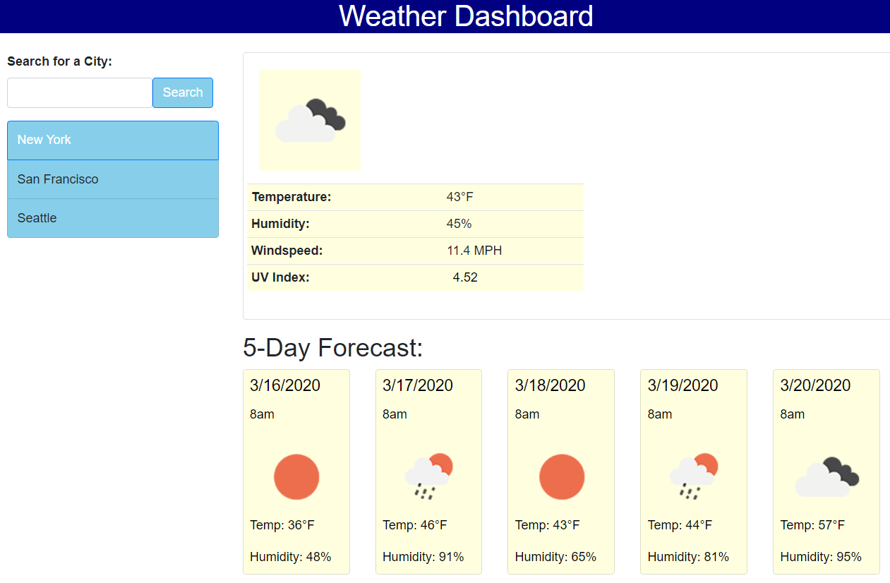
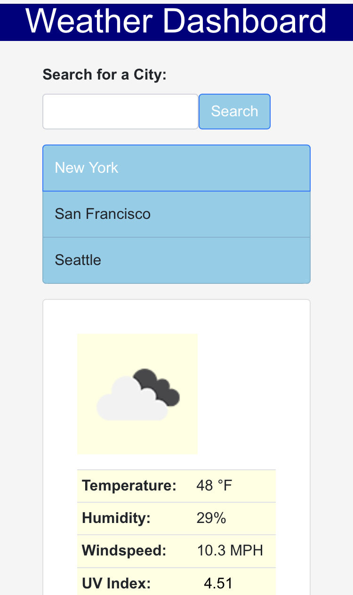

# Weather Dashboard
https://khny258.github.io/Weather-Dashboard/

<strong>Desktop</strong>
 

<strong>Mobile</strong>
 

 
 
<strong>Requirements for the Weather Dashboard:</strong>
1. Create a weather dashboard with form inputs
2. After searching for a city, present current and future conditions and add it to search history
3. Present the UV index
4. The UV index should have colors that indicate whether the conditions are favorable, moderate, or severe (due to time constraints, I didn't get a chance to work on this)
5. Present a 5-day forecast
6. The last search city forecast and its data should be stored in local storage

I used HTML, CSS, JavaScript, jQuery, and the OpenWeather API (https://openweathermap.org/api) for this assignment.

 
The finished product should look like this:

